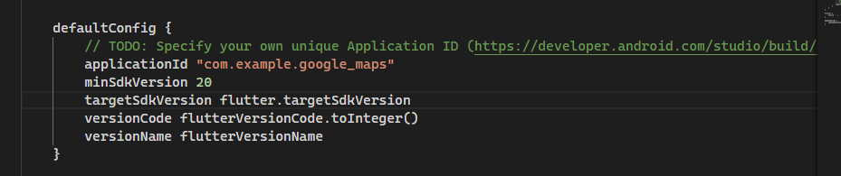
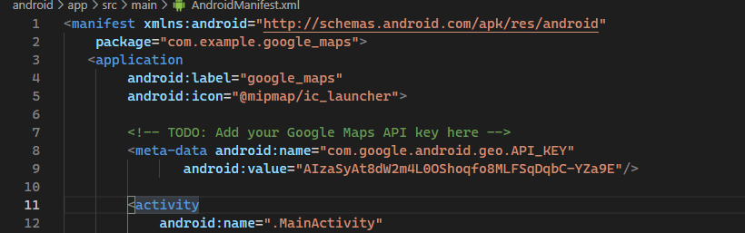
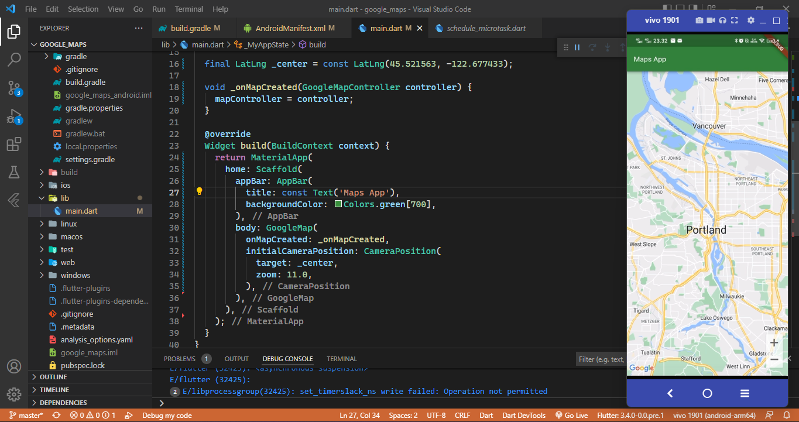
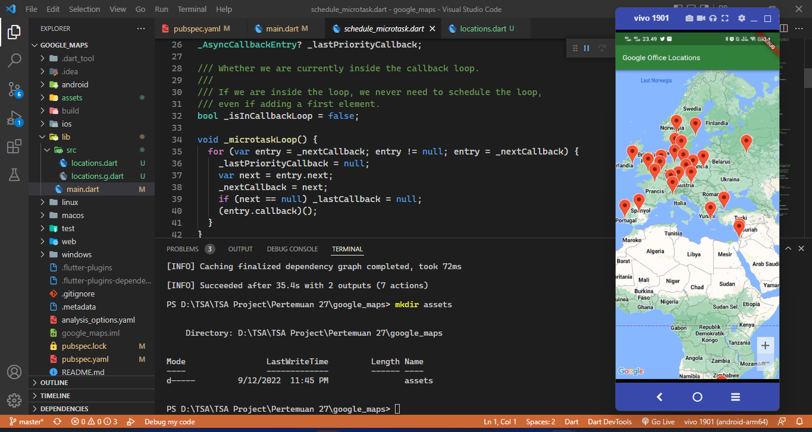
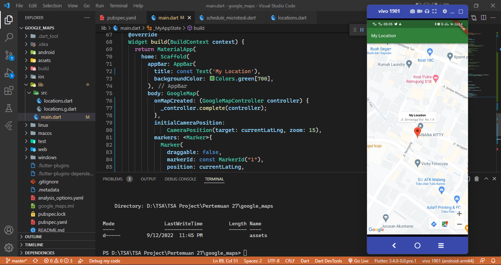

# google_maps

A new Flutter project.

## Menambahkan plugin Google Maps Flutter sebagai dependensi
Pada praktikum ini menambahkan plugin Google Maps Flutter dengan menjalankan perintah berikut 
```
$ flutter pub add google_maps_flutter
```

## Mengkonfigurasi minSDK Android
Untuk menggunakan Google Maps SDK di Android, tetapkan minSDK ke 20. Ubah android/app/build.gradle sebagai berikut.


## Menambahkan kunci API untuk aplikasi Android
Untuk menambahkan kunci API ke aplikasi Android, edit file AndroidManifest.xml di android/app/src/main. Tambahkan satu entri meta-data yang berisi kunci API yang dibuat pada langkah sebelumnya di dalam node application.


## Menampilkan Maps di layar
menampilkan Maps di layar. Update lib/main.dart


## Menempatkan Google di Peta
Pada Langkah ini menggunakan tiga dependensi Flutter baru ke project sebagai berikut. Pertama, paket http,kedua json_serializable untuk mendeklarasikan struktur objek agar merepresentasikan dokumen JSON, Terakhir  build_runner sebagai dependensi waktu pengembangan


## Tugas Praktikum
Buatlah aplikasi flutter yang dapat menampilkan peta dan beri tanda (marker) posisi rumah atau tempat tinggal Anda masing-masing!
